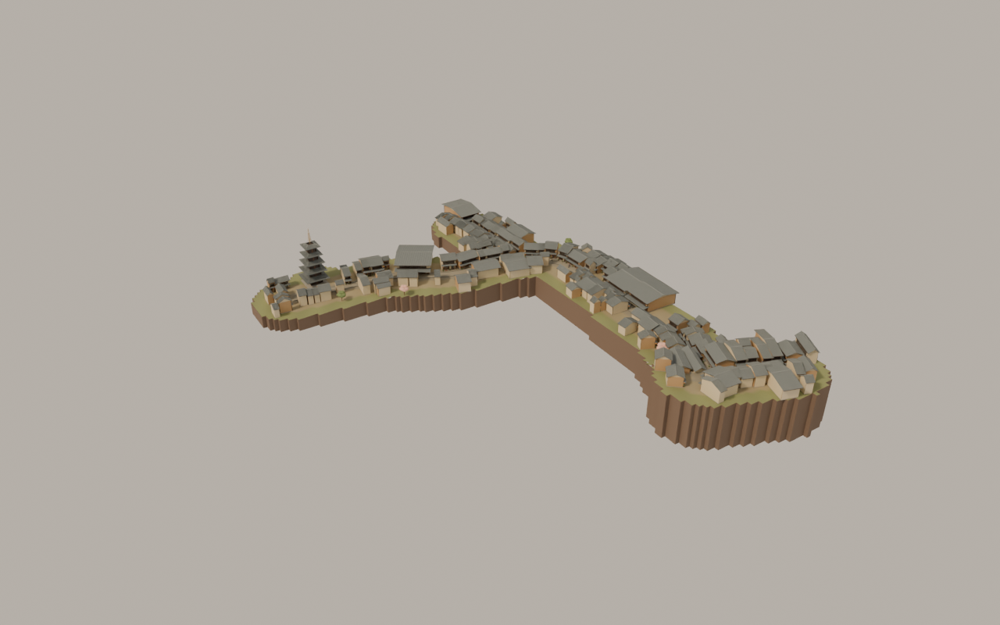

# Multi-Scene Globe · 多场景球体

以 Blender 原生模型与 Three.js / WebGL 构建的黄昏微缩街景：住宅小星球、京都二年坂三年坂，以及可绕行一周的京都球面街区。

A collection of interactive miniature worlds, with Blender-authored assets, autonomous
pedestrians, sliding doors and third-person exploration in the Kyoto scenes.

## 场景配图

以下均为项目自有 Blender 渲染，**不是当前网页实拍截图**；未使用概念生成图替代实际模型。

### 夕暮町 · 河畔樱花小星球

黄昏里的日本住宅微缩街区。沿弯曲道路摆放住宅，加入草地、河流、桥梁、樱花、长椅和街灯，行人自行来往。


夕暮町配图来自共用原生模型的历史 Blender 审核，不展示当前河流、草地和樱花布局。当前治愈版布局请以运行网页为准。

[查看独立分支与更多配图](https://github.com/LiuzhongjiKevin/multi-scene-globe/tree/scene/yugure)

### 京都 · 二年坂与三年坂

以京都东山二年坂、三年坂及周边街道的地图记录为依据，重建石阶段、町屋、店铺与八坂塔，保留原版微缩街区形态。



这些图片是原版京都街区的阶段性 Blender 结构渲染；网页最终灯光、界面、行人动作和后续交互细节以实际运行为准。地图 © OpenStreetMap contributors / ODbL 1.0。

[查看独立分支与更多配图](https://github.com/LiuzhongjiKevin/multi-scene-globe/tree/scene/kyoto)

### 京都 · 二三年坂球面环游

将已有京都街段沿起伏的球面带状区域重排，主街首尾相接。绕过町屋和灯笼后回到起点；二年坂保留为支路。


配图是该闭环场景的 Blender 离线结构渲染，不是浏览器截图。网页最终灯光与界面以实际运行为准。地图 © OpenStreetMap contributors / ODbL 1.0。

[查看独立分支与更多配图](https://github.com/LiuzhongjiKevin/multi-scene-globe/tree/scene/kyoto-loop)

## 运行

先安装 Git 和 Python 3。克隆完整项目：

```sh
git clone https://github.com/LiuzhongjiKevin/multi-scene-globe.git
cd multi-scene-globe
```

也可以在 GitHub 点击 **Code → Download ZIP**，解压后在包含 `dist` 的文件夹打开终端。无需 npm 安装或打包，在仓库根目录运行：

```sh
python3 -m http.server 8080 --directory dist
```

Windows 也可以使用 `py -m http.server 8080 --directory dist`。浏览器打开
[http://localhost:8080](http://localhost:8080)，请通过 HTTP 访问，不要直接双击 HTML。
Three.js 与运行素材均随仓库提供，首次运行无需从 CDN 下载依赖。需要支持 WebGL 2 的浏览器。

## 场景与分支

| 分支 | 内容 | 页面 |
| --- | --- | --- |
| `main` | 全量项目：全部场景、历史源码、模型、地图、建模脚本和审核渲染 | 下列三个入口 |
| `scene/yugure` | 夕暮町住宅小星球：樱花、草地、河流、来往行人 | `index.html` |
| `scene/kyoto` | 京都二年坂三年坂微缩街区 | `index.html` |
| `scene/kyoto-loop` | 京都球面闭环街区 | `index.html` |

`main` 的入口：

- [夕暮町](http://localhost:8080/index.html)
- [京都原版](http://localhost:8080/kyoto.html)
- [京都球面环游](http://localhost:8080/kyoto-loop.html)

独立分支均能自行运行，包含对应的入口、依赖、模型和建模来源，不需要先检出 `main`。

```sh
git clone --branch scene/kyoto-loop https://github.com/LiuzhongjiKevin/multi-scene-globe.git
cd multi-scene-globe
python3 -m http.server 8080 --directory dist
```

## 操作

- 全景：拖动旋转，滚轮缩放；点击店门或住宅门交互。
- 三个场景都有来往行人、第三人称跟随、切换行人与暂停功能。
- 京都两版：点击“自由探索”，WASD / 方向键移动，拖动调整视角，靠近可交互店门后按鼠标左键或 E；Esc 退出探索。
- 京都两版提供触屏摇杆和独立交互按钮。夕暮町目前是行人跟随模式，没有玩家自由移动。
- 球面版主街首尾相接，可连续绕行；二年坂保留为支路。

## 技术与文件

原生 JavaScript ES Modules + Three.js 0.186.0；无需 React/Vue 或构建系统。
Blender 4.3.2 制作房屋、居民、自行车、路灯等原生模型，再导出 GLB。
道路、地形、植被分布、球面弯曲、人物运动、门与相机交互在 Three.js 中完成。
并非整个网页场景直接由一个 Blender 文件导出。

| 路径 | 用途 |
| --- | --- |
| `dist/` | 可直接静态托管的完整前端；这里的 JS 也是可编辑源码 |
| `dist/assets/` | GLB 模型、京都地图和资产来源记录 |
| `dist/vendor/` | 本地 Three.js 与第三方声明 |
| `design-review/yugure-form.blend` | 共用住宅、人物、自行车等模型源文件 |
| `design-review/*.py` | 共用模型建模、审查和导出脚本 |
| `design-review/sannenzaka/` | 京都模型源文件、OSM 源数据、提取脚本与离线渲染 |
| `design-review/sannenzaka-loop/` | 球面街区合成源文件、布局数据与离线渲染 |
| `scripts/check-package.py` | 当前分支入口、模块、资源和页面链接检查 |

`main` 保留旧版 `main.js`、`kyoto-theme.js` 和历史审核文件，用于追溯。
早期京都主题为哲学之道；当前 `kyoto.html` 已是二年坂三年坂。
内部托管配置、服务标识和对话授权摘录不在公开副本中；原发布站点不受影响。
历史模型审核状态仅适用于当时版本，不表示未来修改已获审核。

### 重新生成模型

已提供可直接运行的 GLB，不必安装 Blender。需要修改模型时，可用 Blender 4.3.2
打开 `.blend`；从根目录执行原生建模脚本示例（会更新对应产物）：

```sh
blender --background --python design-review/build.py
blender --background --python design-review/refine_form.py
blender --background --python design-review/export_assets.py
# 京都建筑；住宅独立分支不包含此脚本
blender --background --python design-review/sannenzaka/build_blender.py
```

共用导出脚本保留原有模型审核检查。离线 `district-composition.blend` 是阶段性的
结构审查快照；网页中的最终灯光、运动与相机逻辑以 `dist/` 为准。
各场景的 `render_composition.py` 可重新渲染已保存的合成数据。

## 验证与边界

Python 3 可检查打包资源，Node.js 22+ 可执行已有逻辑检查（使用 `import.meta.dirname`）：

```sh
python3 scripts/check-package.py
# 夕暮町（main / scene/yugure）
node --loader ./design-review/simulation-loader.mjs design-review/check-simulation.mjs
# 京都原版（main / scene/kyoto）
node --loader ./design-review/sannenzaka/test-loader.mjs design-review/sannenzaka/check-runtime.mjs
# 京都球面版（main / scene/kyoto-loop）
node --loader ./design-review/sannenzaka-loop/test-loader.mjs design-review/sannenzaka-loop/check-runtime.mjs
```

逻辑检查使用 Node DOM / 渲染器替身，覆盖人物、门、碰撞、探索与闭环运动；
不等同于浏览器 GPU 渲染、帧率或真机多点触控验证。截图目录里的 PNG 为 Blender
离线结构渲染，不能视为当前网页截图。旧审核记录保留其原有未通过项。

京都道路与建筑锚点来自 OSM；地形高度、立面、店内、灯光为艺术重建。
球面版对已有街段做重排和首尾连接，**不是现实京都地理闭环**，也不是逐栋测绘复刻。

## 开源许可

原创代码、建模脚本和原创模型几何使用 [MIT License](LICENSE)。
第三方依赖保留各自许可；地图数据库 © OpenStreetMap contributors，使用 ODbL 1.0，
不包含在 MIT 重新许可范围。详见 [THIRD_PARTY_NOTICES.md](THIRD_PARTY_NOTICES.md)。

## 常见问题

- **网页空白 / 模型加载失败**：先确认通过 `http://localhost:8080` 访问，而不是 `file://`。不要只复制 HTML；`dist/assets` 和 `dist/vendor` 也必须保留。
- **Python 命令不存在**：Windows 可尝试 `py`；macOS / Linux 使用 `python3`。也可用任意静态 HTTP 服务托管整个 `dist`。
- **8080 已被占用**：把运行命令的端口改为 8081，并打开 `http://localhost:8081`。
- **下载后不知道改哪里**：所有运行 JS 位于 `dist/`。修改 `.blend` 不会自动更新网页，需要导出 GLB；修改运行 JS 后刷新页面。
- **GitHub 仓库页面不是演示网页**：本项目为静态站点源码，克隆后本地运行，或将 `dist` 部署至自己的静态网站服务。
- **性能表现**：建议先在桌面浏览器查看。实际帧率受 GPU、分辨率和浏览器影响，本仓库不承诺移动设备帧率。

## 参与改进

欢迎通过 Issue 描述问题，并附场景分支、浏览器版本和复现步骤。提交改动时请保留原版场景，
在对应分支检查资源依赖与交互逻辑；不要将个人凭据或托管配置提交到仓库。
