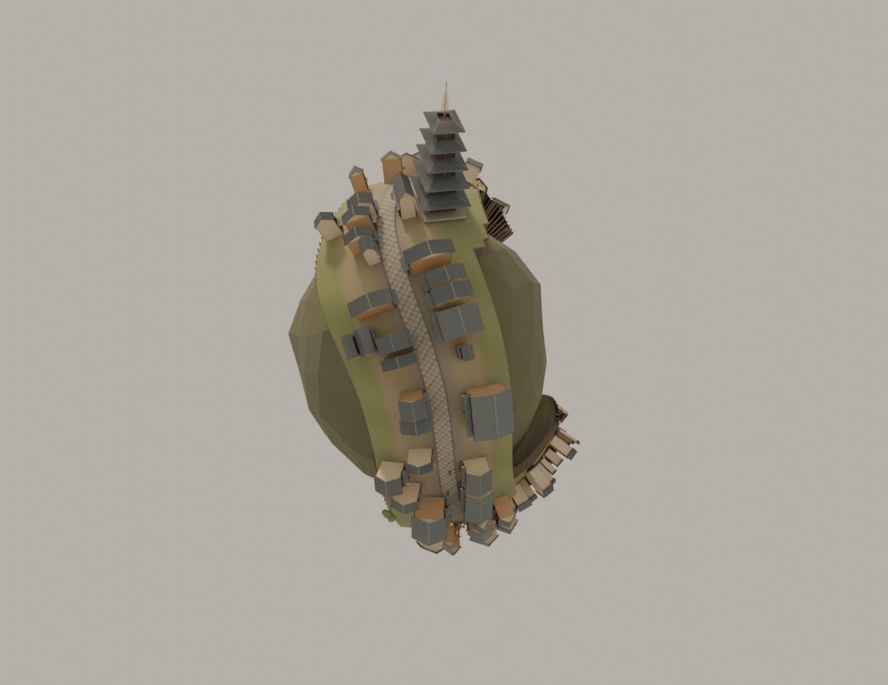
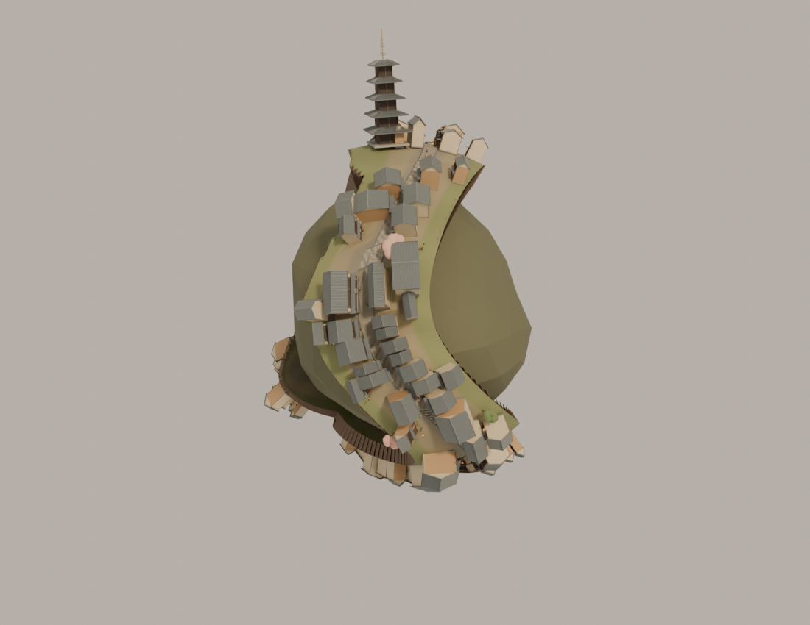

# Multi-Scene Globe · 京都 · 二三年坂球面环游

将已有京都街段沿起伏的球面带状区域重排，主街首尾相接。绕过町屋和灯笼后回到起点；二年坂保留为支路。

这是 **`scene/kyoto-loop`** 独立分支，运行依赖、模型和对应建模来源均已包含，无需下载其他分支。

## 场景配图

配图是该闭环场景的 Blender 离线结构渲染，不是浏览器截图。网页最终灯光与界面以实际运行为准。地图 © OpenStreetMap contributors / ODbL 1.0。



球面环游正面 · Blender 离线结构渲染。



球面环游背面 · Blender 离线结构渲染。

## 包含什么

- 8 个重排街段、121 个保留建筑锚点、24 个可进入店铺和 30 位自主行人。
- 主街连续闭环，玩家和 NPC 在接缝处沿街通过；相机姿态随局部球面调整。
- 自由探索、触屏摇杆、门扇近距离交互、NPC 跟随与暂停。
- 道路之外保留地块支撑，不凭空补造缺失的京都街区。闭环不代表真实地理连接。

## 从零运行

1. 安装 Git 和 Python 3。
2. 克隆当前场景并进入目录：

```sh
git clone --branch scene/kyoto-loop --single-branch https://github.com/LiuzhongjiKevin/multi-scene-globe.git
cd multi-scene-globe
```

也可以在当前分支页面点击 **Code → Download ZIP**，解压后在项目目录打开终端。

3. 启动静态 HTTP 服务：

```sh
python3 -m http.server 8080 --directory dist
```

Windows 可使用 `py -m http.server 8080 --directory dist`。无需 npm 安装或构建。
浏览器打开 [http://localhost:8080](http://localhost:8080)，按 Ctrl+C 停止服务。
请使用 HTTP 访问，不要直接双击 HTML。端口占用时，把 8080 改为 8081。

## 操作

| 操作 | 方法 |
| --- | --- |
| 查看全景 | 鼠标拖动旋转，滚轮缩放 |
| 门扇交互 | 全景中点击门扇 |
| 跟随行人 | 点击“第三人称”或“跟随行人”，再用“换一位”切换 |
| 暂停 / 继续 | 点击暂停按钮 |
| 返回全景 | 点击全景 / 复位按钮 |
| 自由探索 | 点击“自由探索”，WASD / 方向键移动 |
| 探索时看向别处 | 拖动调整视角，滚轮调整距离 |
| 附近交互 | 出现提示后按鼠标左键或 E 操作店门 |
| 退出探索 | Esc 或点击“退出探索” |
| 触屏探索 | 左侧摇杆移动，拖动观察，右侧按钮交互 |

移动受实际道路、门前平台和店内空间约束，关闭的门与建筑墙体不能直接穿过。

## 源码与模型

| 路径 | 用途 |
| --- | --- |
| `dist/index.html` | 本分支唯一网页入口 |
| `dist/loop-main.js` | 场景初始化、动画循环与交互入口 |
| `dist/assets/` | GLB 模型与相应地图数据 |
| `dist/vendor/` | 随仓库提供的 Three.js 依赖与许可 |
| `design-review/` | Blender 原生模型、建模脚本和审核渲染 |

采用原生 JavaScript ES Modules + Three.js 0.186.0 / WebGL 2，不依赖 React 或 Vue。
房屋、居民、自行车等由 Blender 4.3.2 原生建模后导出 GLB；道路、地形、植被布局、
角色动作与相机逻辑由 Three.js 运行。修改 JS 后刷新即可；修改 `.blend` 后需要重新导出模型。

`design-review/sannenzaka-loop/district-composition.blend` 为球面场景的离线合成快照，`composition.json` 保存布局，`render_composition.py` 可重新渲染。共用京都建筑源模型、OSM 提取数据和人物源模型均保留。

模型已经导出，**只运行网页不需要安装 Blender**。共用导出脚本保留历史模型审核检查；
合成 `.blend` 与 PNG 是阶段性快照，不会自动随网页交互代码更新。

## 检查

在仓库根目录运行：

```sh
python3 scripts/check-package.py
node --loader ./design-review/sannenzaka-loop/test-loader.mjs design-review/sannenzaka-loop/check-runtime.mjs
```

逻辑检查需要 Node.js 22+，使用 DOM / 渲染器替身。它验证资源、运动及交互逻辑，
不等同于浏览器 GPU 渲染、帧率或真实触屏设备测试。

## 常见问题

- **空白或加载失败**：确认使用 HTTP；完整保留 `dist/assets` 和 `dist/vendor`，不要只下载 HTML。
- **画面卡顿**：尝试缩小窗口、关闭其他占用 GPU 的程序，或先用桌面浏览器查看。
- **GitHub 页面没有交互画面**：README 只展示静态图。互动场景需运行上述命令，或将整个 `dist` 目录静态托管。

街道与建筑锚点来自 OpenStreetMap；立面、店内、地形高度和灯光为艺术重建，并非测绘级复刻。球面版主街的首尾连接也是艺术改编，不存在这样的现实京都环线。

## 其他场景

[全量主分支](https://github.com/LiuzhongjiKevin/multi-scene-globe/tree/main) · [夕暮町](https://github.com/LiuzhongjiKevin/multi-scene-globe/tree/scene/yugure) ·
[京都原版](https://github.com/LiuzhongjiKevin/multi-scene-globe/tree/scene/kyoto) · [京都球面环游](https://github.com/LiuzhongjiKevin/multi-scene-globe/tree/scene/kyoto-loop)

## 开源许可

原创代码、建模脚本和原创模型几何使用 [MIT](../../LICENSE)。地图数据库与第三方库保留各自许可，
参见 [THIRD_PARTY_NOTICES.md](../../THIRD_PARTY_NOTICES.md)。京都地图与地理布局 © OpenStreetMap contributors / ODbL 1.0。
引用本仓库的地图相关渲染时请同时保留地图署名。
