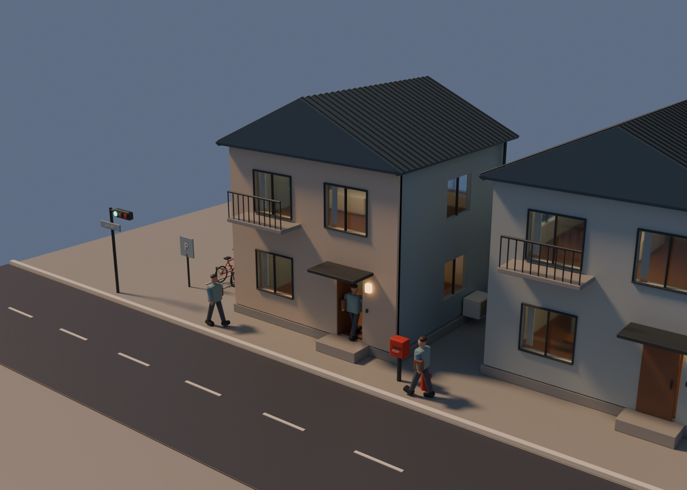
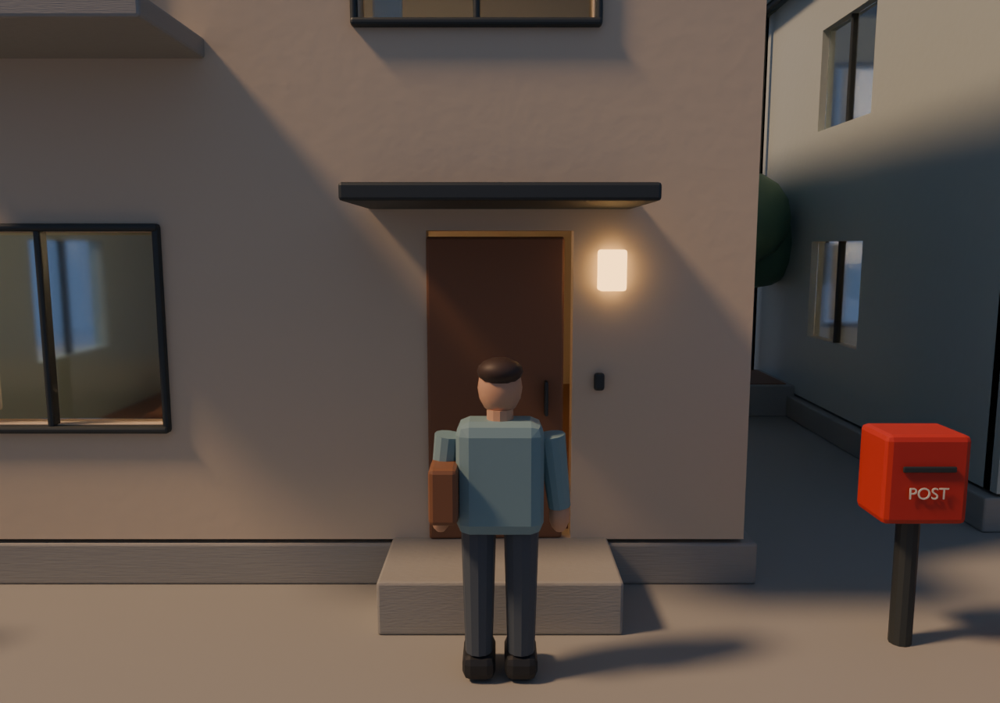

# Multi-Scene Globe · 夕暮町 · 河畔樱花小星球

黄昏里的日本住宅微缩街区。沿弯曲道路摆放住宅，加入草地、河流、桥梁、樱花、长椅和街灯，行人自行来往。

这是 **`scene/yugure`** 独立分支，运行依赖、模型和对应建模来源均已包含，无需下载其他分支。

## 场景配图

夕暮町配图来自共用原生模型的历史 Blender 审核，不展示当前河流、草地和樱花布局。当前治愈版布局请以运行网页为准。



共用住宅、自行车与人物的历史 Blender 建模近景。



人物比例与住宅尺度的历史 Blender 审查视图。

## 包含什么

- 住宅门点击开关，玻璃窗、庭院和自行车等近景细节。
- 河流、桥梁、樱花、草地与自主行人，支持暂停动画。
- 旋转小星球、第三人称跟随、切换跟随对象。此分支没有 WASD 玩家自由移动。

## 从零运行

1. 安装 Git 和 Python 3。
2. 克隆当前场景并进入目录：

```sh
git clone --branch scene/yugure --single-branch https://github.com/LiuzhongjiKevin/multi-scene-globe.git
cd multi-scene-globe
```

也可以在当前分支页面点击 **Code → Download ZIP**，解压后在项目目录打开终端。

3. 启动静态 HTTP 服务：

```sh
python3 -m http.server 8080 --directory dist
```

Windows 可使用 `py -m http.server 8080 --directory dist`。无需 npm 安装或构建。
浏览器打开 [http://localhost:8080](http://localhost:8080)，按 Ctrl+C 停止服务。
请使用 HTTP 访问，不要直接双击 HTML。端口占用时，把 8080 改为 8081。

## 操作

| 操作 | 方法 |
| --- | --- |
| 查看全景 | 鼠标拖动旋转，滚轮缩放 |
| 门扇交互 | 全景中点击门扇 |
| 跟随行人 | 点击“第三人称”或“跟随行人”，再用“换一位”切换 |
| 暂停 / 继续 | 点击暂停按钮 |
| 返回全景 | 点击全景 / 复位按钮 |

此分支的第三人称模式为跟随自主行人，没有 WASD 玩家操控。

## 源码与模型

| 路径 | 用途 |
| --- | --- |
| `dist/index.html` | 本分支唯一网页入口 |
| `dist/next-main.js` | 场景初始化、动画循环与交互入口 |
| `dist/assets/` | GLB 模型与相应地图数据 |
| `dist/vendor/` | 随仓库提供的 Three.js 依赖与许可 |
| `design-review/` | Blender 原生模型、建模脚本和审核渲染 |

采用原生 JavaScript ES Modules + Three.js 0.186.0 / WebGL 2，不依赖 React 或 Vue。
房屋、居民、自行车等由 Blender 4.3.2 原生建模后导出 GLB；道路、地形、植被布局、
角色动作与相机逻辑由 Three.js 运行。修改 JS 后刷新即可；修改 `.blend` 后需要重新导出模型。

`design-review/yugure-form.blend` 保存共用原生模型；`build.py`、`refine_form.py` 和 `export_assets.py` 为建模及 GLB 导出脚本。

模型已经导出，**只运行网页不需要安装 Blender**。共用导出脚本保留历史模型审核检查；
合成 `.blend` 与 PNG 是阶段性快照，不会自动随网页交互代码更新。

## 检查

在仓库根目录运行：

```sh
python3 scripts/check-package.py
node --loader ./design-review/simulation-loader.mjs design-review/check-simulation.mjs
```

逻辑检查需要 Node.js 22+，使用 DOM / 渲染器替身。它验证资源、运动及交互逻辑，
不等同于浏览器 GPU 渲染、帧率或真实触屏设备测试。

## 常见问题

- **空白或加载失败**：确认使用 HTTP；完整保留 `dist/assets` 和 `dist/vendor`，不要只下载 HTML。
- **画面卡顿**：尝试缩小窗口、关闭其他占用 GPU 的程序，或先用桌面浏览器查看。
- **GitHub 页面没有交互画面**：README 只展示静态图。互动场景需运行上述命令，或将整个 `dist` 目录静态托管。

## 其他场景

[全量主分支](https://github.com/LiuzhongjiKevin/multi-scene-globe/tree/main) · [夕暮町](https://github.com/LiuzhongjiKevin/multi-scene-globe/tree/scene/yugure) ·
[京都原版](https://github.com/LiuzhongjiKevin/multi-scene-globe/tree/scene/kyoto)

## 开源许可

原创代码、建模脚本和原创模型几何使用 [MIT](../../LICENSE)。地图数据库与第三方库保留各自许可，
参见 [THIRD_PARTY_NOTICES.md](../../THIRD_PARTY_NOTICES.md)。京都地图与地理布局 © OpenStreetMap contributors / ODbL 1.0。
引用本仓库的地图相关渲染时请同时保留地图署名。
